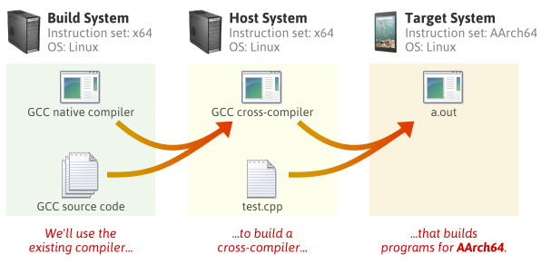
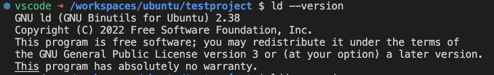
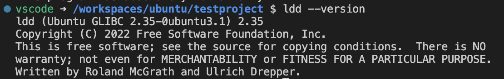
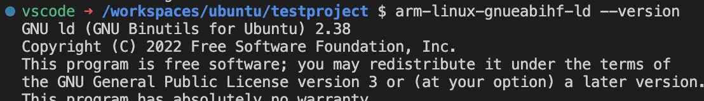

# CrossCompiling Template for ARMhf C/C++
## Overview
This project provides a comprehensive guide to cross-compiling and remote debugging code execution on ARMhf targets.



For a detailed explanation of the concept of cross-compilation, visit [Cross Compilation Guide](https://www.codeinsideout.com/blog/c-cpp/cross-compilation/).


## Setting Up the Development Environment
Before you begin, ensure that Visual Studio Code (VS Code) is installed on your system. VS Code is a versatile, lightweight, and open-source integrated development environment that is accessible on multiple platforms.

### Required VS Code Extensions

To kickstart project, you'll need to install the following essential VS Code extensions:

| Extension                | Description                                           | Publisher  |
|--------------------------|-------------------------------------------------------|------------|
| CMake                    | Provides CMake language support for VS Code          | twxs       |
| C/C++ Themes             | Offers user interface themes for the C/C++ extension | Microsoft  |
| C/C++ Extension Pack     | A collection of popular extensions for C++ development in VS Code | Microsoft  |
| C/C++                    | Delivers C/C++ IntelliSense, debugging, and code browsing features | Microsoft  |
| CMake Tools              | Extends CMake support within Visual Studio Code     | Microsoft  |

With these extensions, your development environment will be equipped for efficient C/C++ development in VS Code.

### Setting Up the Host Environment

It is recommended to use Ubuntu 18.04 as the development environment. If you already have an Ubuntu machine, that's ideal. Otherwise, macOS and Windows users can benefit from Dev Containers. To use Dev Containers as your development environment, follow these steps:

**Using Dev Containers**

1. Install Docker Desktop or OrbStack (recommended for macOS).
2. Install the Dev Container VS Code Extension.

After installing VS Code, open it, and a green button will appear in the bottom left corner. Click on it and select "Create Dev Container...". A drop-down menu will open; scroll down and select "Ubuntu," then choose "Create Dev Container `ubuntu`". The Dev Container setup process may take some time. After successful creation, a new window will open, directing you to the workspace inside the created Dev Container.

### Apple Silicon Users

If you're using a Mac M1/M2, your environment architecture will be arm64, potentially causing issues when running x64 executables later on. To address this in your Docker environment, execute the following commands in your shell:

```bash
# Check the OS architecture; if it shows x86_64, skip the next steps.
lscpu

# Enable multi-architecture support.
sudo dpkg --add-architecture amd64

# Fix repositories.
echo 'deb [arch=amd64,i386] http://us.archive.ubuntu.com/ubuntu/ jammy main restricted universe multiverse
deb [arch=amd64,i386] http://us.archive.ubuntu.com/ubuntu/ jammy-updates main restricted universe multiverse
deb [arch=amd64,i386] http://us.archive.ubuntu.com/ubuntu/ jammy-backports main restricted universe multiverse
deb [arch=amd64,i386] http://security.ubuntu.com/ubuntu jammy-security main restricted universe multiverse

deb [arch=arm64] http://ports.ubuntu.com/ubuntu-ports/ jammy main restricted universe multiverse
deb [arch=arm64] http://ports.ubuntu.com/ubuntu-ports/ jammy-updates main restricted universe multiverse
deb [arch=arm64] http://ports.ubuntu.com/ubuntu-ports/ jammy-backports main restricted universe multiverse
deb [arch=arm64] http://ports.ubuntu.com/ubuntu-ports/ jammy-security main restricted universe multiverse' | sudo tee /etc/apt/sources.list

# Install necessary libraries.
sudo apt update


```

## Installing Required Packages and Libraries

Now, let's install the necessary dependencies and packages for the project:

```sh
sudo apt install cmake make gdb-multiarch git sshpass
```

If you plan to build small libraries (like libmodbus, etc.) for use in this project, you'll need to install these packages as well:

```bash
sudo apt install bison cvs flex gperf texinfo automake libtool libssl-dev bc libncurses5-dev
```

If you want to install additional libraries for your development environment, you can run the following command:

```sh
sudo apt install build-essential curl python3 python3-pip autoconf automake autotools-dev libmpc-dev libmpfr-dev libgmp-dev gawk bison flex texinfo gperf  patchutils zlib1g-dev libexpat-dev libtinfo5 libncurses-dev libncurses5 libncurses5-dev libncursesw5-dev device-tree-compiler pkg-config file autogen autoconf-archive 
```

Lastly, if you wish to install other optional tools useful for your development environment, you can run the following command:

```sh
sudo apt install ubuntu-dev-tools 
```

## Selecting the Right Cross-Compiler
To successfully run your program on the target system, it's crucial to ensure that the executable firmware is built (or linked) with a compatible version of the glibc shared library dependency. Here's how to address this:

1. Determine the glibc version of your locally compiled program:

```sh
ld —version
```


2. Verify the glibc version on the host/target OS:
```sh
ldd —version
```


3. To find the glibc version of a specific cross-compiler, run:

```sh
arm-linux-gnueabihf-ld --version
```


Ensure that the cross-compiler's glibc version is equal to or lower than the glibc version on the target OS.

## Installing Cross-Compilers

### Using Debian Official Compiler

Debian or Ubuntu provides pre-built cross-compilers for various processor architectures. To find available cross-compilers for ARM processors, use:

```sh
apt-cache search gcc-arm
```

You can also find cross-compilers for other architectures, like MIPS:

```sh
apt-cache search gcc-mips
```

To install cross-compilers for different targets, use the following commands:

- For Allwinner H3-based Board, Raspberry Pi 3, BeagleBone Black Target:

```sh
sudo apt install gcc-arm-linux-gnueabihf g++-arm-linux-gnueabihf binutils-arm-linux-gnueabihf
```

- For Arietta, Aria, or FOX G20 board:

```sh
sudo apt install gcc-arm-linux-gnueabi g++-arm-linux-gnueabi binutils-arm-linux-gnueabi
```

- For Raspberry Pi Pico or any ARM Cortex-M Board:

```sh
sudo apt install gcc-arm-none-eabi g++-arm-none-eabi libnewlib-arm-none-eabi binutils-arm-none-eabi
```

### Using Prebuilt Toolchains

If you face GLIBC version compatibility issues with official cross-compilers, consider using prebuilt cross-compilers like [Linaro Toolchains](https://releases.linaro.org/components/toolchain/binaries/). Download the version that suits your project requirements.

For example, the `gcc-linaro-7.5.0-2019.12` Toolchain is suitable for Raspberry Pi 32-bit or BeagleBone Black Target, thanks to glibc version 2.28 compatibility. 
[Download Linaro GCC ToolChain](https://releases.linaro.org/components/toolchain/binaries/7.5-2019.12/arm-linux-gnueabihf/gcc-linaro-7.5.0-2019.12-x86_64_arm-linux-gnueabihf.tar.xz)

For targets requiring lower GLIBC versions (e.g., nanopi H3), use vendor-provided toolchains compatible with your target:
[Download FriendlyARM Servers Toolchain](http://112.124.9.243/qtsdk-friendlyelec/h3/toolchain-4.9.3.tgz)

## Compiling, Deploying, and Remote Debugging the Firmware

This project has a simple structure that's easy to get started with. It's configured for VS Code IDE, allowing you to easily compile, deploy, and run binaries on the target using VS Code automation. IDE configuration files can be found in the `.vscode` directory, and automation scripts are provided in `cross-compile.sh` and `deploy.sh`.

The source code is available in the `src/main.cpp` directory:
```
├── .vscode
│   ├── c_cpp_properties.json
│   ├── launch.json
│   ├── settings.json
│   └── tasks.json
├── Makefile
├── README.md
├── cross-compile.sh
├── deploy.sh
├── firmware.bin
└── src
    └── main.cpp
```

If you're using a custom toolchain like Linaro, configure the settings in the makefile's "CC," "CPP," "AR," "RANLIB," and "LD" variables to match the relative path of the compiler in the toolchain. For example:

```makefile
CPP=../gcc-linaro-7.5.0-2019.12-x86_64_arm-linux-gnueabihf/bin/arm-linux-gnueabihf-g++
CC=../gcc-linaro-7.5.0-2019.12-x86_64_arm-linux-gnueabihf/bin/arm-linux-gnueabihf-gcc 
AR=../gcc-linaro-7.5.0-2019.12-x86_64_arm-linux-gnueabihf/bin/arm-linux-gnueabihf-ar 
RANLIB=../gcc-linaro-7.5.0-2019.12-x86_64_arm-linux-gnueabihf/bin/arm-linux-gnueabihf-ranlib
LD=../gcc-linaro-7.5.0-2019.12-x86_64_arm-linux-gnueabihf/bin/arm-linux-gnueabihf-ld
```

Target configuration settings can be found in the .vscode/settings.json file. Here, you can customize the following parameters:

`TARGET_IP`: The IP address of the target device on the LAN.

`BINARY`: The name of the binary file (default is "firmware.bin").

`SDK_DIR`: The directory path to the Toolchain for the target device

`DEST_DIR`: The directory on the target device where you want to place the binary

`USER`: The SSH username for connecting to the target device.

`PASS`: The SSH password for connecting to the target device.

Make sure that the values of IP, SSH username and password are set according to the target system.
```json
{
    "TARGET_IP": "192.168.176.82",
    "DEBUG_PORT": "6666",
    "BINARY": "firmware.bin",
    "SDK_DIR": "/usr/arm-linux-gnueabihf/bin/",
    "DEST_DIR": "/home/debian",
    "USER": "debian",
    "PASS": "temppwd"
}
```
You can run the program by pressing `F5` in VS Code; the IDE will handle building the binary, sending it to the target, and running the remote GDB Debugger. Alternatively, use the provided `cross-compile.sh` and `deploy.sh` scripts to manually build and deploy the binary.
